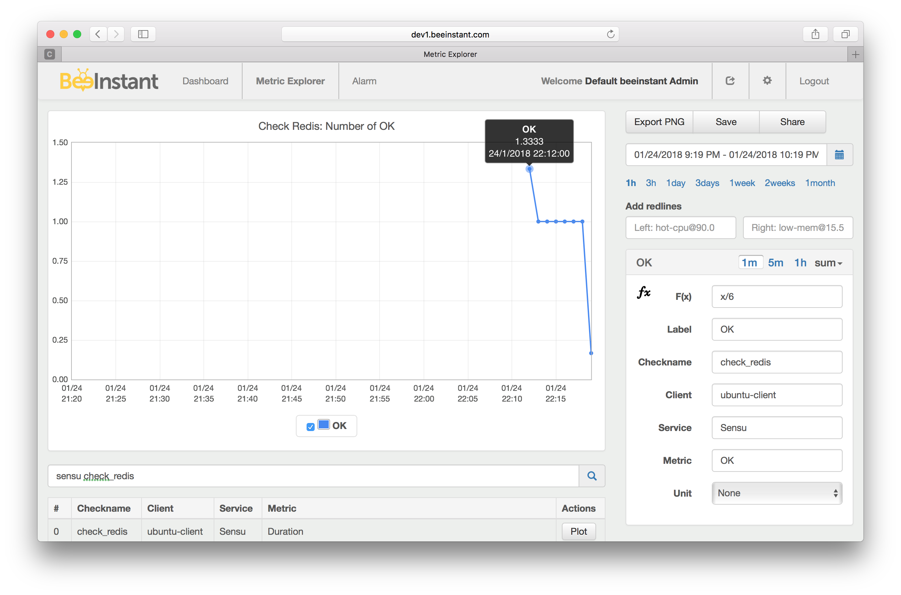
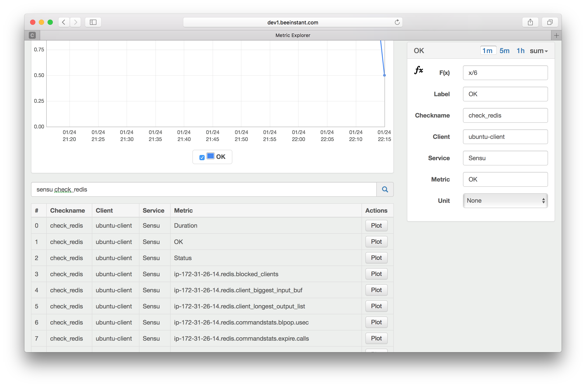

# Sensu-Integration
Ship metrics from Sensu to BeeInstant.

>BeeInstant is a centralized modern metric monitoring platform. It is designed from day 1 to handle both infrastructure metrics and service/business level metrics at scale and with high-quality data. BeeInstant consolidates metrics from many different sources (Sensu, CollectD for infrastructure metrics; BeeInstant's SDKs for service/business level metrics), provides intelligent tools for engineers to slice and dice, manipulate metrics, put alarms, share graphs, build data-driven teams and organizations. Ultimately BeeInstant facilitates DevOps teams to ship high-quality software fast and reliable. BeeInstant brings visibility into customer experiences, so Product teams can improve and optimize their product offerings.
>
>Getting started FREE today: https://beeinstant.com

## Build
```bash
mvn package
```

Output: `target/sensu-integration.jar`.

## Run
```bash
java -cp target/sensu-integration.jar \
    -Dbeeinstant.endpoint=$BEEINSTANT_ENDPOINT \
    -Dbeeinstant.publicKey=$BEEINSTANT_PUBLIC_KEY \
    -Dbeeinstant.secretKey=$BEEINSTANT_SECRET_KEY \
    -Dsensu.client.log=/var/log/sensu/sensu-client.log \
    com.beeinstant.sensu.SensuMonitor
```

## Graph
**Example: graph sensu redis check OK status**



**Example: search sensu metrics**



HAPPY MONITORING!

BeeInstant Team
